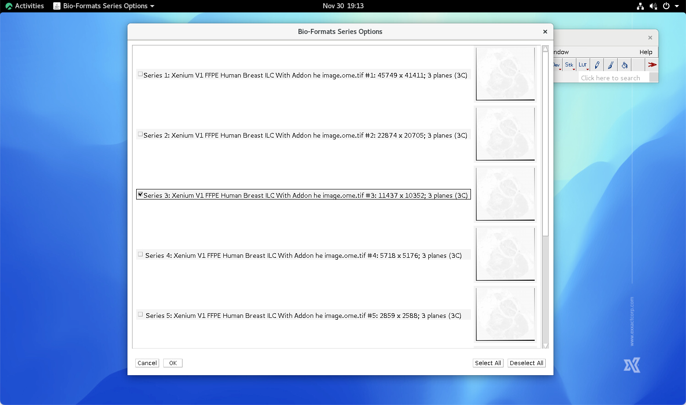

.. qust documentation master file, created by
   sphinx-quickstart on Sat Sep 21 13:44:35 2024.
   You can adapt this file completely to your liking, but it should at least
   contain the root `toctree` directive.

:Authors:
    Chao-Hui Huang

:Version: 1.0 of 2024/10/24
:Dedication: To Everyone contribution to QuST

Image Alignments
================

FYI

Load H&E Images into FIJI

First, click "File -> Import -> Bio-Formats" and select the corresponding H&E image file.

In Bio-Formats Import Options, using options as showing below.

.. image:: artifacts/fiji-bioformats-import-options.png
   :width: 640pt

Next, select the Series Number. The higher series number, e.g., Series 1, the higher resolution. However, higher resolution may result OOM (out-of-memory) if the resource is limitied. On the other hand, lower resolution may limit the accuracy of the following preocess. To author's experience, Series 3 is usually a good balance.

Click Ok button, the chosen H&E whoile slide image will be loas as a RGB stack in FIJI.

.. image:: artifacts/fiji-wsi-he-stack.png
   :width: 640pt

