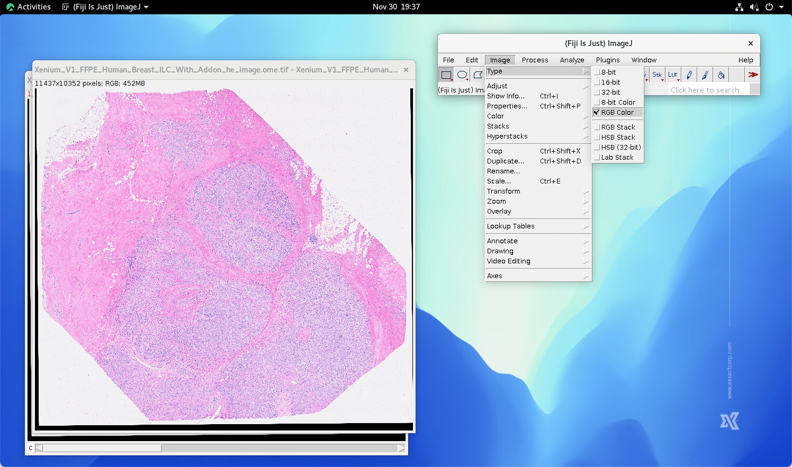

.. qust documentation master file, created by
   sphinx-quickstart on Sat Sep 21 13:44:35 2024.
   You can adapt this file completely to your liking, but it should at least
   contain the root `toctree` directive.

:Authors:
    Chao-Hui Huang

:Version: 1.0 of 2024/10/24
:Dedication: To Everyone contribution to QuST

Load H&E Images into FIJI
=========================

First, click "File -> Import -> Bio-Formats" and select the corresponding H&E image file.

.. image:: artifacts/fiji-file-import-bioformats.png
   :width: 400pt

In Bio-Formats Import Options, using options as showing below.

.. image:: artifacts/fiji-bioformats-import-options.png
   :width: 400pt

Next, select the Series Number. The higher series number, e.g., Series 1, the higher resolution. However, higher resolution may result OOM (out-of-memory) if the resource is limitied. On the other hand, lower resolution may limit the accuracy of the following preocess. To author's experience, Series 3 is usually a good balance.

.. image:: artifacts/fiji-bioformats-series-options.png
   :width: 400pt

Click Ok button, the chosen H&E whoile slide image will be loas as a RGB stack in FIJI. Note that in this example, we used `FFPE Human Breast with Custom Add-on Panel
provided by 10x Genomics
<https://www.10xgenomics.com/datasets/ffpe-human-breast-with-custom-add-on-panel-1-standard>`_. Currently, 10x Genomics has performmed image registration for all of the H&E images in their database. Thus, if the user is using their image as the example, some unexpected noises (e.g., black strips at the edges of the H*E image) have to be removed beforehand.

.. image:: artifacts/fiji-wsi-he-stack.png
   :width: 400pt

The type of the loaded H&E image is RGB stack. It is necessary to convert the type to RGB Color by selecting Image->Type->RGB Color.

H&E Color Deconvolution
=======================

AT this step, we will perform color deconvolution for extracting nuiclei signals (which is highly related to hematoxylin staing of an H&E image). First, use Image->Colod->Color Deconvolution function in FIJI...

.. image:: artifacts/fiji-image-color-color-deconvolution.png
   :width: 400pt

...and select the desired color space. the vector of the chosen color space should be selected accordingly. In this case, we used "H&E".

The RGB Color image is deconvoluted. 3 additional 8 bit images are generated.

.. image:: artifacts/fiji-wsi-he-deconvoluted.png
   :width: 400pt

Since only the hematoxylin channel is needed, the rest images can be closed. Here the LUT is also replaced by Gray for better visually investigation.

The hematoxylin has to be inverted as showning below:

.. image:: artifacts/fiji-wsi-hematoxylin-invteted.png
   :width: 400pt

Below is an additional process which may not applicable for all cases. The user may have to remove the strips on the edges of the image if you are using H&E images provided by 10x Genomics, since 10x Genomics have performmed alignment for all of the H&E images in their dataset. This won't be the case for most of the users.

.. image:: artifacts/fiji-wsi-hematoxylin-invteted-cleaned.png
   :width: 400pt

The residual signal in the background needs to be remove. This step can be done by performming Process->Substrate background...

.. image:: artifacts/fiji-wsi-hematoxylin-inverted-cleaned-background-removed.png
   :width: 400pt

Then, we perform histogram equalization by using Image->Adjust->Brightness/Contrast

Hit the Auto button, the histogram equalization will be executed accordingly. 

Hit "Apply" and then hit "Ok" to save the equalized signal. The nuclei signal obtained from H&E image thus is ready at this stage.

