.. qust documentation master file, created by
   sphinx-quickstart on Sat Sep 21 13:44:35 2024.
   You can adapt this file completely to your liking, but it should at least
   contain the root `toctree` directive.

:Authors:
    Chao-Hui Huang

:Version: 1.0 of 2024/10/24
:Dedication: To Everyone contribution to QuST

Image Alignment
===============

Load H&E Images into FIJI
*************************

First, click "File -> Import -> Bio-Formats" and select the corresponding H&E image file.

.. image:: artifacts/fiji-file-import-bioformats.png
   :width: 400pt

In Bio-Formats Import Options, using options as showing below.

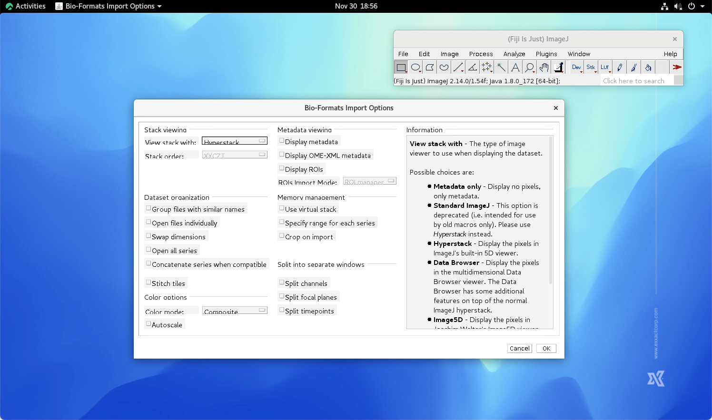

Next, select the Series Number. The higher series number, e.g., Series 1, the higher resolution. However, higher resolution may result OOM (out-of-memory) if the resource is limitied. On the other hand, lower resolution may limit the accuracy of the following preocess. To author's experience, Series 3 is usually a good balance.

.. image:: artifacts/fiji-bioformats-series-options.png
   :width: 400pt

Click Ok button, the chosen H&E whoile slide image will be loas as a RGB stack in FIJI. Note that in this example, we used `FFPE Human Breast with Custom Add-on Panel
provided by 10x Genomics
<https://www.10xgenomics.com/datasets/ffpe-human-breast-with-custom-add-on-panel-1-standard>`_. Currently, 10x Genomics has performmed image registration for all of the H&E images in their database. Thus, if the user is using their image as the example, some unexpected noises (e.g., black strips at the edges of the H*E image) have to be removed beforehand.

The type of the loaded H&E image is RGB stack. It is necessary to convert the type to RGB Color by selecting Image->Type->RGB Color.

.. image:: artifacts/fiji-image-type-rgb-color.png
   :width: 400pt

H&E Color Deconvolution
***********************

AT this step, we will perform color deconvolution for extracting nuiclei signals (which is highly related to hematoxylin staing of an H&E image). First, use Image->Colod->Color Deconvolution function in FIJI...

...and select the desired color space. the vector of the chosen color space should be selected accordingly. In this case, we used "H&E".

.. image:: artifacts/fiji-color-deconvolution-options.png
   :width: 400pt

The RGB Color image is deconvoluted. 3 additional 8 bit images are generated.

Since only the hematoxylin channel is needed, the rest images can be closed. Here the LUT is also replaced by Gray for better visually investigation.

.. image:: artifacts/fiji-wsi-hematoxylin.png
   :width: 400pt

The hematoxylin has to be inverted as showning below:

Below is an additional process which may not applicable for all cases. The user may have to remove the strips on the edges of the image if you are using H&E images provided by 10x Genomics, since 10x Genomics have performmed alignment for all of the H&E images in their dataset. This won't be the case for most of the users.

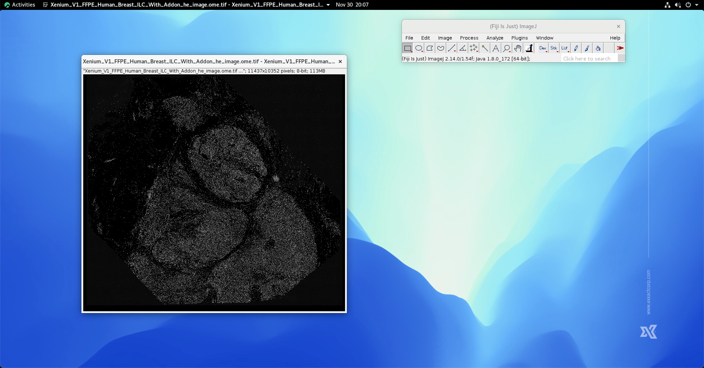

The residual signal in the background needs to be remove. This step can be done by performming Process->Substrate background...

Then, we perform histogram equalization by using Image->Adjust->Brightness/Contrast

.. image:: artifacts/fiji-image-adjust-brightness-contrast.png
   :width: 400pt

Hit the Auto button, the histogram equalization will be executed accordingly. 

.. image:: artifacts/fiji-wsi-hematoxylin-inverted-cleaned-background-removed-equalized.png
   :width: 400pt

Hit "Apply" and then hit "Ok" to save the equalized signal. The nuclei signal obtained from H&E image thus is ready at this stage.

Load DAPI Images into FIJI
**************************

Click "File -> Import -> Bio-Formats" and select the corresponding DAPI image file. The corresponding MIP (maximum intensity projection) is used in this case.

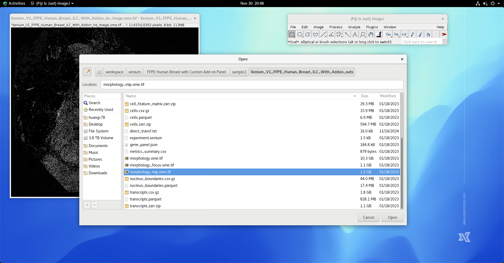

Using below options to load DAPI image.

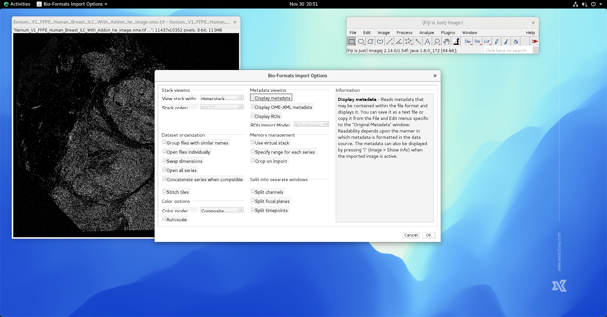

Select the series number same as when loading the corresponding H&E image.

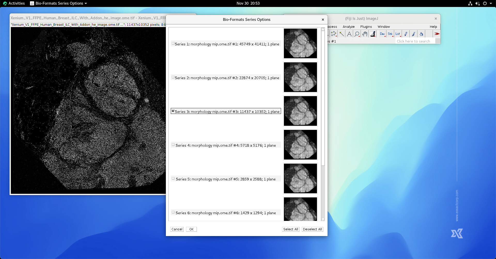

It is normal if you see a whole black image right after loading the chosen DAPI. 

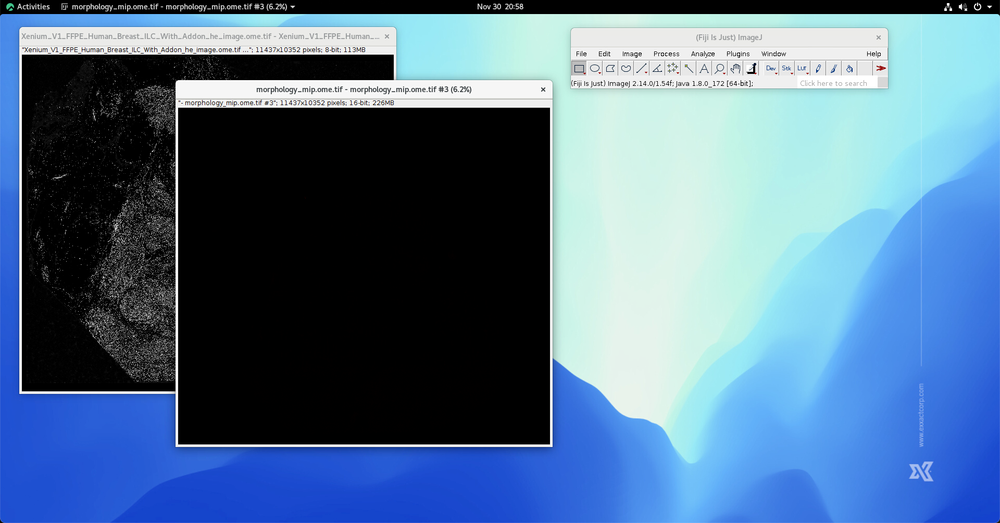

Perform histogram equalization by Image->Adjust->Brightness/Contrast, and click Auto, then hit Apply.

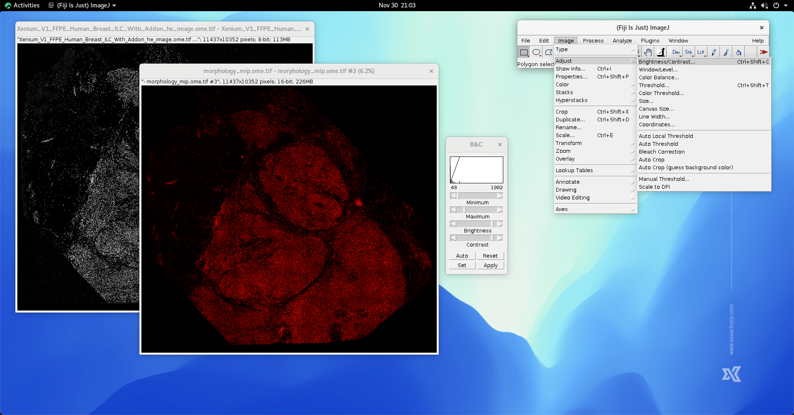

We also convert the LUT to gray in order to perform better visual investigation.

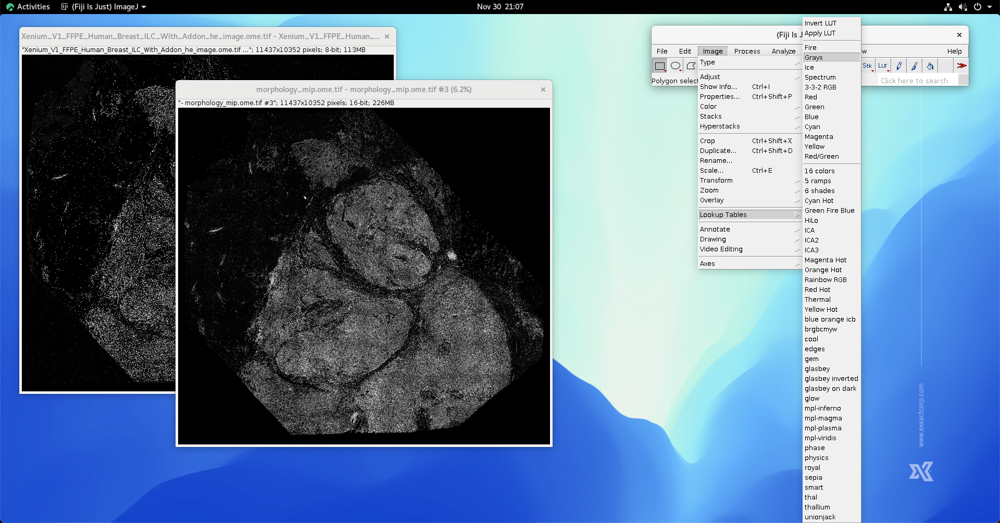

In most cases, DAPI image is stored in 16-bit format. The image has to be converted into 8-bit format by clicking Image->Type->8-bit.

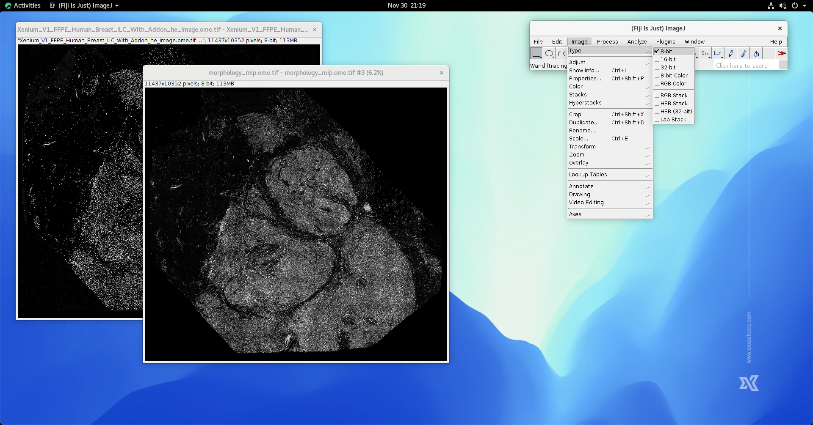

At this stage, DAPI image is loaded. 

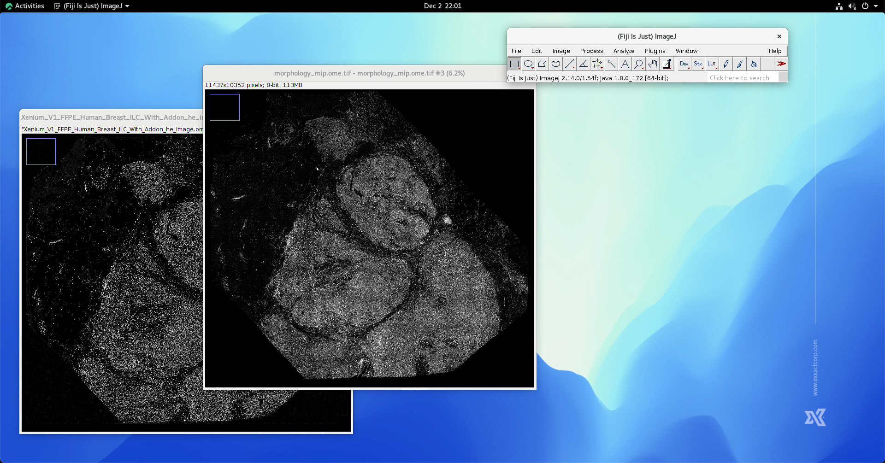

Linear Image Stack Alignment using SIFT
***************************************

First, generate a image stack using the above obtained hematoxylin and DAPI channels by clicking Image->Stacks->Image to Stack.

In most cases, the obtained H&E image (here, the hematoxylin channel) and the DAPI image havve different dimension. In this case, the stacking method needs to be "Copy (top-left)". In addition, you may want to enable "keep source images" since you may need image dimension.

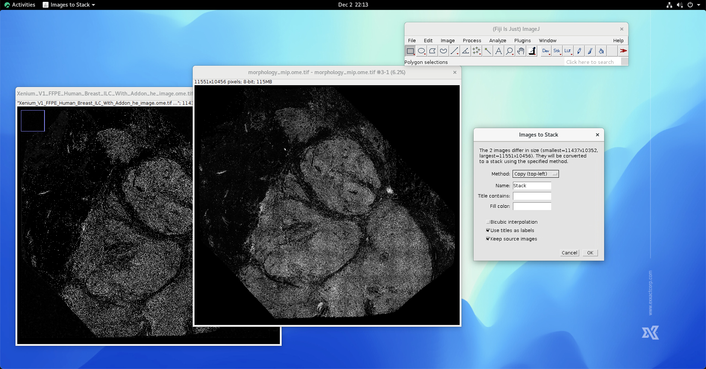

Make sure the hematoxylin channel is at the first position of the generated image stack.

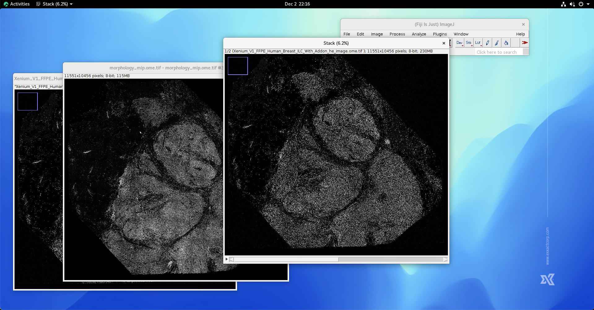

Next, start SIFT process by clicking Plugins->Registration->Linear Stack Alignment SIFT. Select "Affine" in the "expect transformation" option, and enable "show transformation matrix".

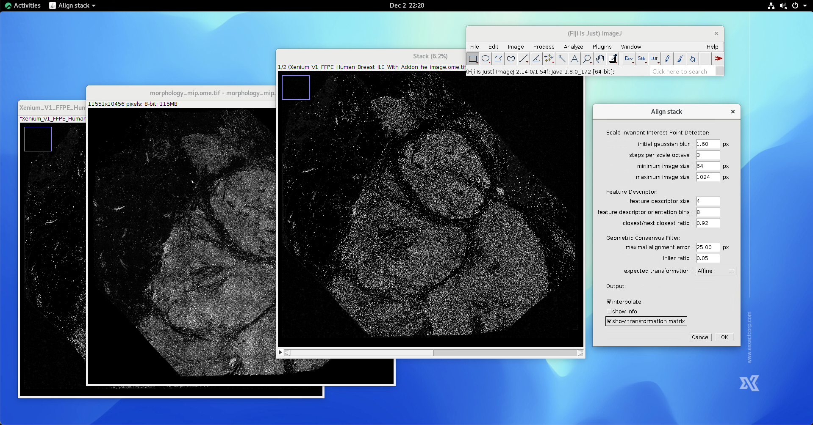

Click Ok, in a moment, the result will be generated. You can zoom-in into the detail of the image and observe the result of SIFT.

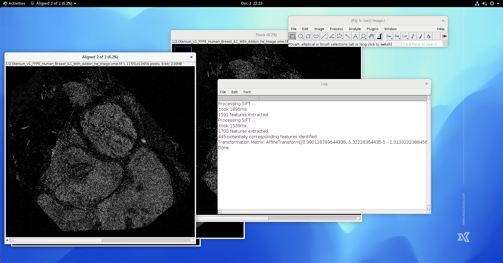

If the above hematoxylin and DAPI channels have different dimension, it is necessary to crop the image. This step can be done by making an rectangular annotation. The top-left of the rectangular annotation is aligned to the top-left of the image stack. The width and weight of the rectangular annotation are the same as the hematoxylin channel. The trick is, using the mouse creating the rectangular annotation, then, fine-tunning the width and height of the rectangular annotation by holding ALT key and pressing top-down/left-right keys.

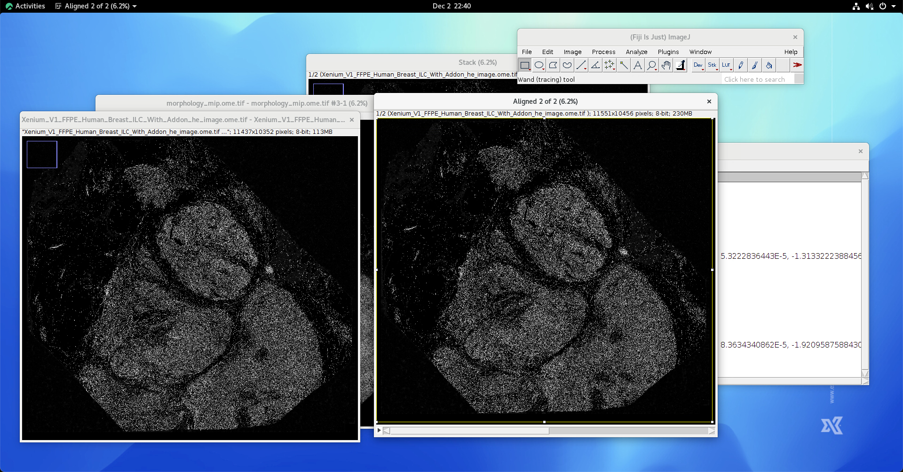

Once the rectangular annotation is generated, click Image->Crop to crop the image stack so that the dimension of the image stack is restored.

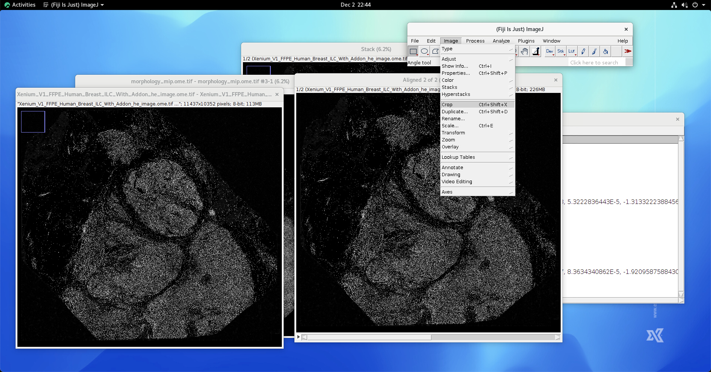

You can zoom-in and inspect the result of linear image registration 

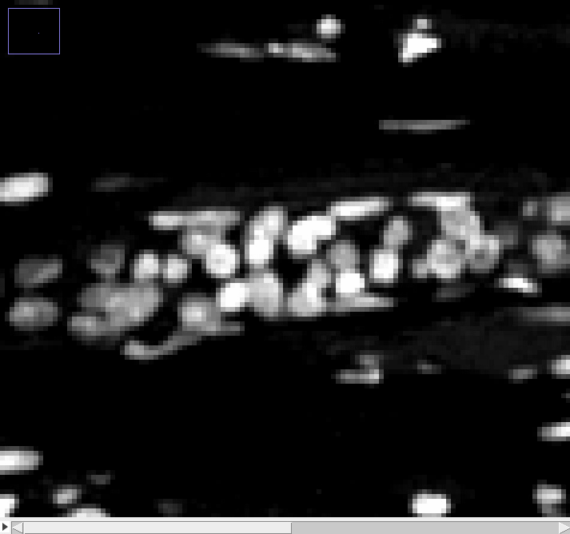

Now, switch to the Log window, click on the obtained transformation matrix, hit right mouse button and hit "Copy".

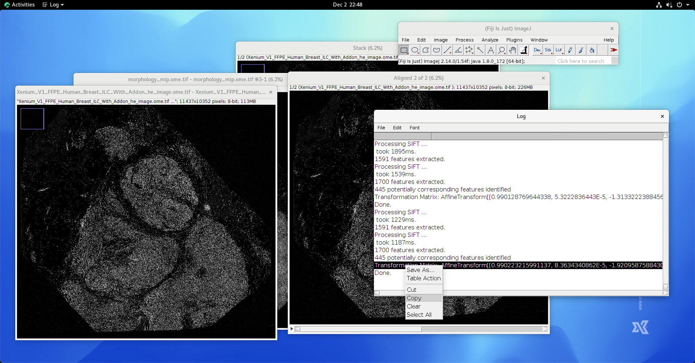

At this stage, the linear transformation matrix is obtained.

Now, let's import the transformation matrix to QuST environment. Start QuPath, and open the corresponding H&E image.

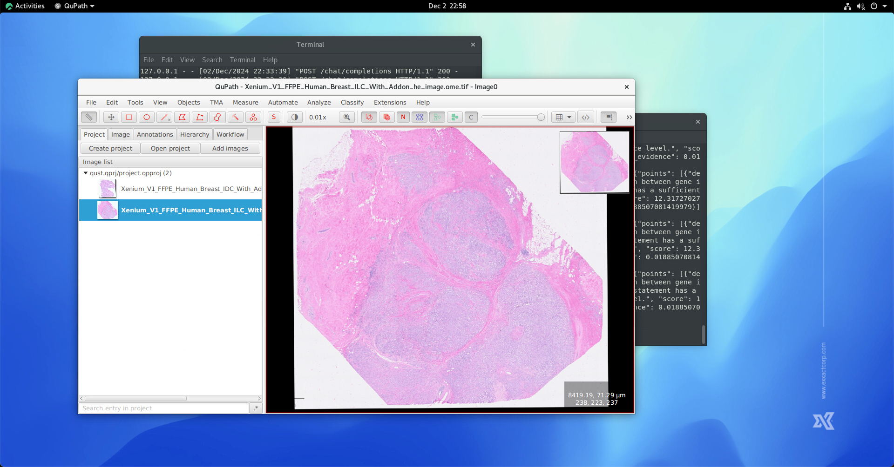

In a QuPath environment with QuST, click Extension->QuST Analysis Toolbox->Pixel Size Calibration by Xenium Affine Matrix, fill the fields as following:

* Xenium outout folder: the "outs" folder that was delivered by the vendor.
* DAPI image pixel size: currently this value is 0.2125, which may or may not consist with your data. Please consult your vendor.
* Image series: using the image series id used when processing H&E and DAPI images.
* Affine Matrix: paste the affine matrix obtained in the previous step.

Then, hit "Run" button. The corresponding pixel size and affine matrix for linear registration will be saved. 

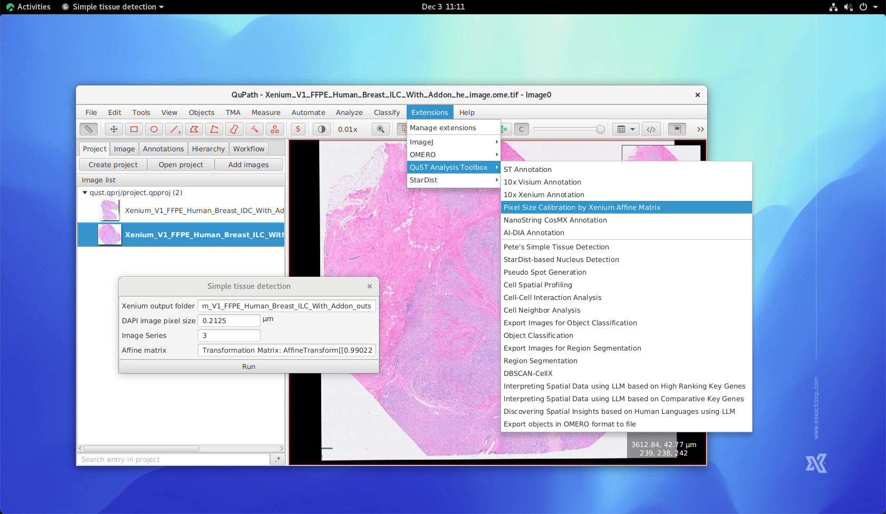

Non-linear Image Stack Alignment using bUnwrap
**********************************************
